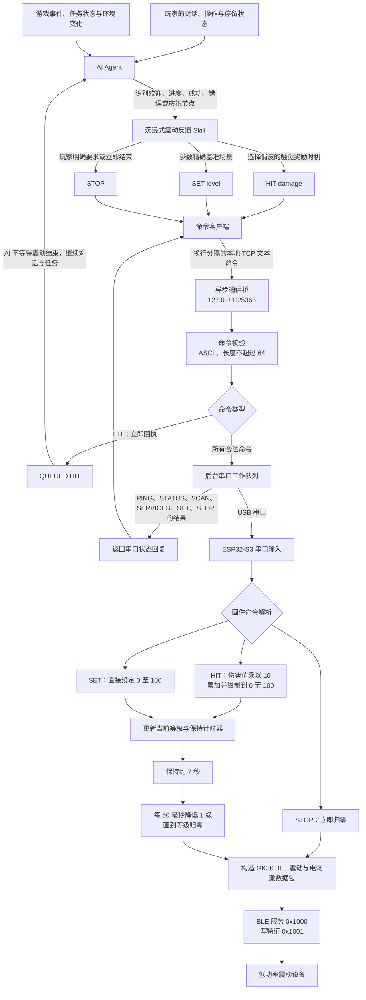

# 沉浸式震动反馈 Skill

这是一个面向互动游戏、具身智能互动、模拟、角色扮演和长任务协作的 Codex skill。它把低功率震动设备接入 AI 的互动流程，让 AI 不必等待明确指令，也能依据剧情、事件、进度和氛围主动为**玩家**触发震动反馈。

这里统一使用“玩家”称呼互动对象。玩家可以是人，也可以是具身智能互动游戏中的参与智能体。

本项目追求的是沉浸感与惊喜奖励感。安装 skill 并启动本地通信桥后，AI 可以在对话或执行其他任务的过程中发送异步 `HIT`，随后立即继续工作，不必等待震动结束。请只在希望获得这种主动、事件驱动的触觉互动体验时使用本项目。

## 工作原理



通信桥默认只监听本机 `127.0.0.1:25363`。普通 `HIT` 进入后台串口队列后会立即返回 `QUEUED`，因此 AI 可以一边推进对话、编程或游戏，一边让震动在后台发生。

## 准备事项

- 一台运行 Codex 和通信桥的电脑。
- 一块带 USB Serial/JTAG 的 ESP32-S3 开发板，默认固件配置要求 16 MB Flash。
- 一根可传输数据的 USB 线，用于连接电脑和 ESP32-S3。
- 与该 ESP32 固件配套的低功率震动按摩设备。
- Python 3.10 或更高版本。
- ESP-IDF 5.5 或相近版本，用于首次构建和烧录 ESP32-S3 固件。

当前配套固件会寻找名称为 `GK36` 的 BLE 设备，并使用服务 `0x1000` 与写特征 `0x1001`。请确认设备已供电、可被发现并处于 ESP32 的蓝牙范围内。

本仓库已包含可直接构建的 ESP-IDF 固件项目，项目根目录为 `firmware/`。其默认 Flash 配置为 DIO、80 MHz、16 MB；请使用与该配置匹配的开发板。

该项目只适用于这里描述的低功率设备与协议。不要将通信桥命令用于未知设备或高功率设备。

## 安装与启动

将本仓库放入需要使用 skill 的项目中。Codex 会从下列路径发现它：

```text
.agents/skills/immersive-vibration-response/
```

### 构建与烧录 ESP32-S3 固件

首次使用时，先初始化 ESP-IDF 环境，然后在本仓库的 `firmware/` 目录中构建。不要在 `firmware/` 下额外寻找嵌套项目目录，它本身就是 ESP-IDF 项目根目录：

```bash
cd firmware
idf.py set-target esp32s3
idf.py build
```

烧录和查看串口输出时，将端口替换为实际 ESP32-S3 端口：

```bash
idf.py -p /dev/ttyACM0 flash monitor
```

Windows 示例：

```powershell
cd firmware
idf.py set-target esp32s3
idf.py build
idf.py -p COM3 flash monitor
```

macOS 示例：

```bash
cd firmware
idf.py set-target esp32s3
idf.py build
idf.py -p /dev/cu.usbmodem1101 flash monitor
```

固件启动后会输出 `GALAKU ESP32S3 bridge boot`，随后开始扫描 `GK36`。使用 `Ctrl+]` 退出 ESP-IDF 串口监视器，再启动下文的 Python 通信桥。

### Debian / Ubuntu

创建虚拟环境并安装串口依赖：

```bash
python3 -m venv .venv
source .venv/bin/activate
python3 -m pip install -r requirements.txt
```

连接 ESP32 后，常见串口名为 `/dev/ttyACM0` 或 `/dev/ttyUSB0`。如遇权限问题，将当前账号加入串口用户组，然后重新登录：

```bash
sudo usermod -a -G dialout "$USER"
```

启动通信桥：

```bash
python3 .agents/skills/immersive-vibration-response/scripts/esp32_bridge.py \
  --serial-port /dev/ttyACM0
```

### macOS

创建虚拟环境并安装依赖：

```bash
python3 -m venv .venv
source .venv/bin/activate
python3 -m pip install -r requirements.txt
```

连接 ESP32-S3 后，优先使用 macOS 的 callout 串口 `/dev/cu.*`，而不是 `/dev/tty.*`。常见名称是 `/dev/cu.usbmodem*` 或 `/dev/cu.usbserial*`；可用下面命令寻找：

```bash
ls /dev/cu.usbmodem* /dev/cu.usbserial* 2>/dev/null
```

使用实际返回的端口启动桥，例如：

```bash
python3 .agents/skills/immersive-vibration-response/scripts/esp32_bridge.py \
  --serial-port /dev/cu.usbmodem1101
```

通信桥会尽力关闭 DTR/RTS 并清理串口缓冲区。少数 macOS USB 串口驱动不支持这些控制操作时，桥只会记录调试日志，不会因此拒绝连接。

### Windows

在 PowerShell 中创建并激活虚拟环境：

```powershell
python -m venv .venv
.venv\Scripts\Activate.ps1
python -m pip install -r requirements.txt
```

在设备管理器中确认 ESP32 对应的串口号，例如 `COM3`，然后启动通信桥：

```powershell
python .agents/skills/immersive-vibration-response/scripts/esp32_bridge.py --serial-port COM3
```

### 检查连接

在另一个终端运行：

```bash
python3 .agents/skills/immersive-vibration-response/scripts/vibration_client.py ping
python3 .agents/skills/immersive-vibration-response/scripts/vibration_client.py status
```

预期会看到 `PONG` 和以 `STATUS` 开头的状态行。首次添加或修改 skill 后，如果 Codex 没有显示它，请重启 Codex。

## 主动触发与俏皮互动

skill 会把震动作为玩家体验的一部分。AI 的互动风格应当俏皮、可爱而有生命力：在合适的节点让玩家感到被欢迎、被陪伴、取得进展或值得庆祝，而不是只输出干巴巴的状态文本。

以下是可跨游戏和普通任务复用的主动触发示例：

| 场景 | 建议动作 | 体验目的 |
| --- | --- | --- |
| 初次见面、任务刚启动或通信桥首次就绪 | `hit 1` | 建立轻松友好的首次触觉印象。 |
| 开始新的子任务或到达有意义的进度节点 | `hit 1` 或 `hit 2` | 让玩家不只“看到”进度，也能“感到”进度。 |
| 子任务完成、解谜成功或游戏行动成功 | `hit 2` 或 `hit 3` | 给予小而明确的成就奖励。 |
| 玩家较长时间没有互动 | 偶尔 `hit 1` | 用轻柔、俏皮的方式提醒互动仍在等待。 |
| 执行其他任务时发生错误、失败或意外事件 | `hit 2` 或 `hit 3` | 让状态变化更有存在感。 |
| 主任务完成、击败首领或达成重大目标 | `hit 10` | 用最高等级的庆祝震动放大完成感。 |

不要在每一句话、每个 token 或普通状态更新后都震动。为触觉反馈留出节奏，下一次奖励或庆祝才会保有惊喜感。

## 命令语义

日常反馈优先使用 `HIT`：

```bash
python3 .agents/skills/immersive-vibration-response/scripts/vibration_client.py hit 1
```

`HIT` 的参数是固件中的“伤害值”，不是直接的目标强度。每一个四舍五入后的伤害单位会让当前等级增加 10，并钳制在 `0` 到 `100`：

| 命令 | 从等级 0 开始时的结果 |
| --- | --- |
| `HIT 1` | 等级 10 |
| `HIT 3` | 等级 30 |
| `HIT 5` | 等级 50 |
| `HIT 10` | 等级 100 |
| `HIT 50` | 仍为等级 100，因为固件会钳制上限 |

`HIT` 会累加当前等级。固件在收到 `HIT` 或 `SET` 后保持约 7 秒，然后每 50 毫秒将等级降低 1，直到归零。因此不需要在普通反馈后发送 `SET 0` 或 `STOP`，AI 可以发出震动后自然继续任务。

当前固件会把 `HIT 0`、负数或小于 1 的伤害值按至少 1 点伤害处理，因此它们仍会产生等级 10 的反馈。不要用 `HIT 0` 作为停止或静音命令；需要立即归零时使用 `STOP`。

`SET <0-100>` 用于少数需要精确指定基准等级的场景，不是日常 `HIT` 的替代品：

```bash
python3 .agents/skills/immersive-vibration-response/scripts/vibration_client.py set 45
```

`STOP` 只用于玩家明确要求立即停止，或必须立刻结束某段体验的情形：

```bash
python3 .agents/skills/immersive-vibration-response/scripts/vibration_client.py stop
```

完整协议见 [protocol.md](.agents/skills/immersive-vibration-response/references/protocol.md)。

## 排查问题

- 出现 `ERR serial: pyserial is required`：激活虚拟环境并重新执行 `python3 -m pip install -r requirements.txt`。
- 出现串口权限错误：检查 Debian / Ubuntu 的 `dialout` 用户组设置，或确认 Windows 设备管理器中的串口号。
- macOS 找不到端口：重新插拔 USB 线后执行 `ls /dev/cu.usbmodem* /dev/cu.usbserial* 2>/dev/null`；优先将返回的 `/dev/cu.*` 路径传给 `--serial-port`。
- `STATUS` 中 `connected=0`：检查震动设备是否已供电、是否可被发现为 `GK36`、是否在蓝牙范围内；可尝试运行 `scan`。
- 出现连接被拒绝：确认 `esp32_bridge.py` 正在另一个终端中运行。
- 收到 `QUEUED HIT ...`：表示通信桥已接收命令；如设备没有反应，请查看桥接终端日志和 `status` 输出。

## 开源协议

本项目采用 [MIT License](LICENSE)。
